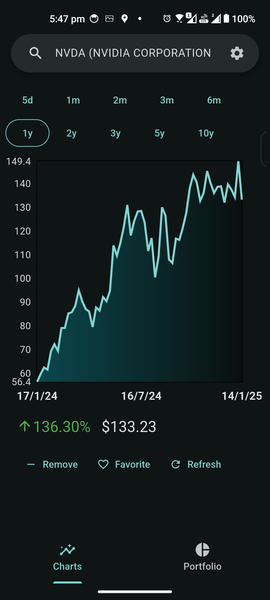
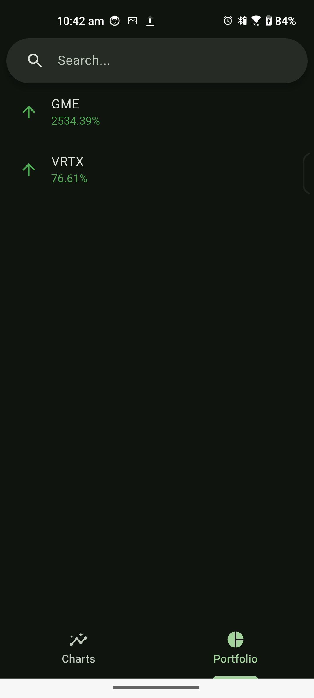
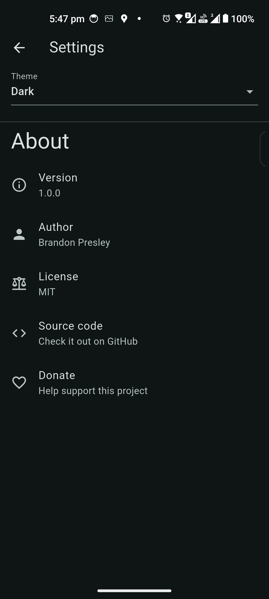
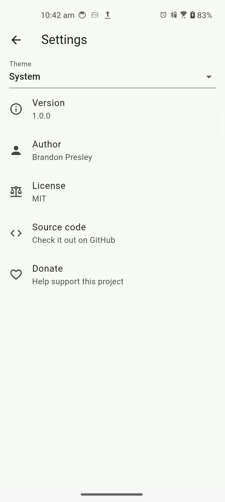
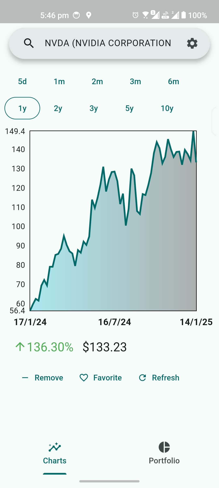
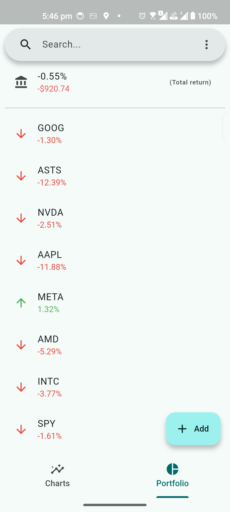

# MarketMonk

Track stocks on any platform 📈

<p float="left">
  <a href="https://github.com/brandonp2412/MarketMonk/releases/latest"></a>
    <a href="#"></a>
</p>

# Features

- 💹 Line graph stocks (with Yahoo Finance Data)
- 🥧 Build and monitor your portfolio
- ⚙️ Customize to your hearts desires

<p float="left">
<a href="https://play.google.com/store/apps/details?id=com.codesail.market_monk"></a>
<a href="https://f-droid.org/packages/com.codesail.market_monk"></a>
<a href="https://apps.microsoft.com/detail/9PP4HKV1CMWC?mode=direct"></a>
</p>

<br />
<p float="left">
    
    
    
    
    
    
</p>

# Donations

If you would like to support this project:

- Bitcoin `bc1qzlte8featxzf7xvtp3rjv7qqtwkgpup8hu85gp`
- Monero (XMR) `85tmLfWKbpd8nxQnUY878DDuFjmfcoCFXPWR7XYKLHBSbDZV8wxgoKYUtHtq1kHWJg4m14sdBXhYuUSbxEDA29d19XuREL5`
- [GitHub sponsor](https://github.com/sponsors/brandonp2412)

# Contributing

All issues and pull requests are welcome! Bugs will be fixed faster if you include reproduction steps (and maybe [logs](https://developer.android.com/tools/logcat)). Any performance related pull requests will bring tears of joy to my eye.

# Developers

Install [flutter](https://docs.flutter.dev/get-started/install) to run this app.

## Migrations

After editing any table in `lib/tables.dart` you need to:

1. Bump `schemaVersion` in `lib/database.dart`
2. Run `dart run drift_dev make-migrations`
3. Add the relevant migration step in `lib/database.dart` `migrationSteps`.
   e.g.

```dart
from3To4: (Migrator m, Schema4 schema) async {
  await m.createTable(schema.candles);
},
```

4. Run `dart run build_runner build -d`

## Attribution

<a href="https://www.flaticon.com/free-icons/meditation" title="meditation icons">Meditation icons created by Freepik - Flaticon</a>
