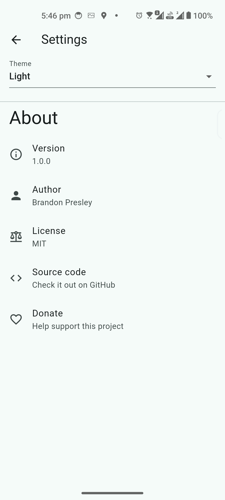

# Market Monk

Track stocks on any platform 📈 - without ads or being spied on 🕵️

<video src="https://github.com/user-attachments/assets/91e84369-f6a1-4d87-bac7-aa23d812cde7" width="315" height="640"></video>

<p float="left">
    
    
    
    
    
    
</p>

## Pre-publish requirements

1. <strike>Offline caching</strike>
2. <strike>Settings ⚙</strike>️

## Platforms we intend to support

- <strike>Android</strike>
- iOS
- <strike>Windows</strike>
- MacOS
- Linux

## What about web?

Might give it a shot later on but i've had trouble with the drift package on flutter web in the past.

# Features

1. Quickly view a stocks price graph 🤑
2. Easily switch between periods 📅
3. Manage a portfolio of tracked stocks 💵

## Coming soon...

4. <strike>Offline caching of stock data</strike> 😎
5. Have portfolio amounts and track gains/losses since purchase date 🍰
6. Customizable settings for everything! ⚙️
7. Compare multiple stocks on line graphs

# Developers

Install [flutter](https://docs.flutter.dev/get-started/install) to run this app.

## Migrations

After editing any table in `lib/tables.dart` you need to:

1. Bump `schemaVersion` in `lib/database.dart`
2. Run `dart run drift_dev make-migrations`
3. Add the relevant migration step in `lib/database.dart` `migrationSteps`.
   e.g.

```dart
from3To4: (Migrator m, Schema4 schema) async {
  await m.createTable(schema.candles);
},
```

4. Run `dart run build_runner build -d`

## Attribution

<a href="https://www.flaticon.com/free-icons/meditation" title="meditation icons">Meditation icons created by Freepik - Flaticon</a>
