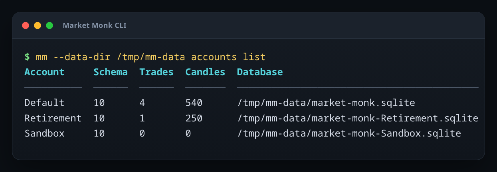
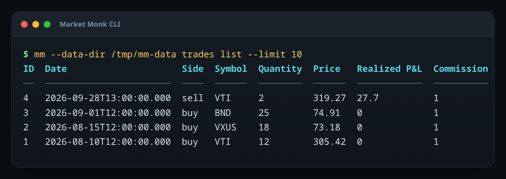
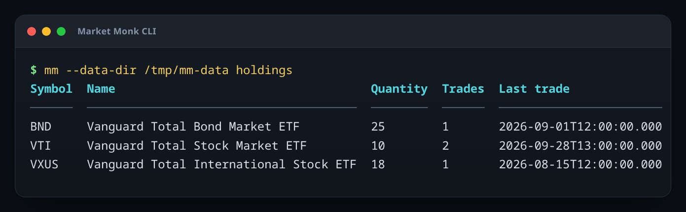

# Market Monk CLI

Market Monk includes a Dart command-line client for inspecting and editing the same SQLite user data used by the desktop app.



## Install `mm`

From a Market Monk checkout:

```sh
./tool/install_mm.sh
```

The installer only needs `dart` on `PATH` (the Flutter SDK already includes it). It resolves the CLI's small standalone dependency set in a temporary build directory, so installing `mm` does not rewrite the app's `pubspec.lock`. It builds a native-assets bundle, exposes it as `~/.local/bin/mm`, and keeps the bundled SQLite runtime under `~/.local/lib/market-monk-cli/`.

On a normal Linux setup, `~/.local/bin` should already be in `PATH`. If it is not, add this to your shell startup file and reopen the shell:

```sh
export PATH="$HOME/.local/bin:$PATH"
```

Verify the installation from anywhere:

```sh
mm --help
```

To update `mm` after pulling newer Market Monk code, run `./tool/install_mm.sh` again. To uninstall it:

```sh
rm ~/.local/bin/mm
rm -rf ~/.local/lib/market-monk-cli
```

Set `MM_INSTALL_DIR` if you want a different install directory:

```sh
MM_INSTALL_DIR="$HOME/bin" ./tool/install_mm.sh
```

## Basics

The CLI defaults to Market Monk's normal desktop application-support directory and the `Default` profile. On Linux that is `~/.local/share/com.codesail.market_monk`.

Discover the profile databases Market Monk can see:

```sh
mm accounts list
```

Inspect the selected database:

```sh
mm info
```

Select another Market Monk profile with `--account`:

```sh
mm --account 1 holdings
mm --account 1 trades list --symbol VTI
```

Use an explicit database file when working with a copy or backup:

```sh
mm --db ~/backups/market-monk.sqlite info
```



## Trade operations

List recent trades:

```sh
mm trades list
mm trades list --symbol VTI --limit 20
mm trades list --since 2026-01-01 --until 2026-12-31
```

Add a trade:

```sh
mm trades add \
  --symbol VTI \
  --name "Vanguard Total Stock Market ETF" \
  --side buy \
  --quantity 2 \
  --price 312.45 \
  --date 2026-10-02
```

Inspect or update one trade:

```sh
mm trades get 12
mm trades update 12 --price 313.10
```

Delete a trade only with explicit confirmation:

```sh
mm trades delete 12 --yes
```

Market Monk stores sell quantities as negative values internally; the CLI accepts `--side buy|sell` and handles that representation for you.

## Holdings

`holdings` derives each open quantity directly from the trade ledger:

```sh
mm holdings
```



## Market-data cache

Inspect downloaded candle-cache coverage:

```sh
mm candles stats
mm candles stats --symbol VTI
```

Clear cached candles so Market Monk can fetch them again:

```sh
mm candles clear --symbol VTI --yes
mm candles clear --yes
```

Clearing candles does not delete the trade ledger.

## Backups

Create a consistent backup of one selected profile database:

```sh
mm backup ~/backups/market-monk.sqlite
```

Use `--overwrite` to replace an existing destination. This command is intentionally a single-profile SQLite backup. The app's full ZIP backup/restore feature additionally includes all profiles and preferences.

## Read-only SQL

For ad-hoc inspection, `query` accepts read-only `SELECT`, `PRAGMA`, `WITH`, and `EXPLAIN` statements:

```sh
mm query "SELECT symbol, SUM(quantity) AS quantity FROM trades GROUP BY symbol"
```

Mutating SQL is rejected; use the explicit trade/cache commands for writes.

## Automation and output

Add `--json` when scripting:

```sh
mm --json trades list --symbol VTI
```

Interactive terminals use ANSI colour automatically. `NO_COLOR` disables it. You can also force either mode:

```sh
mm --color holdings
mm --no-color holdings
```

Destructive commands require `--yes`; ordinary reads never do.
